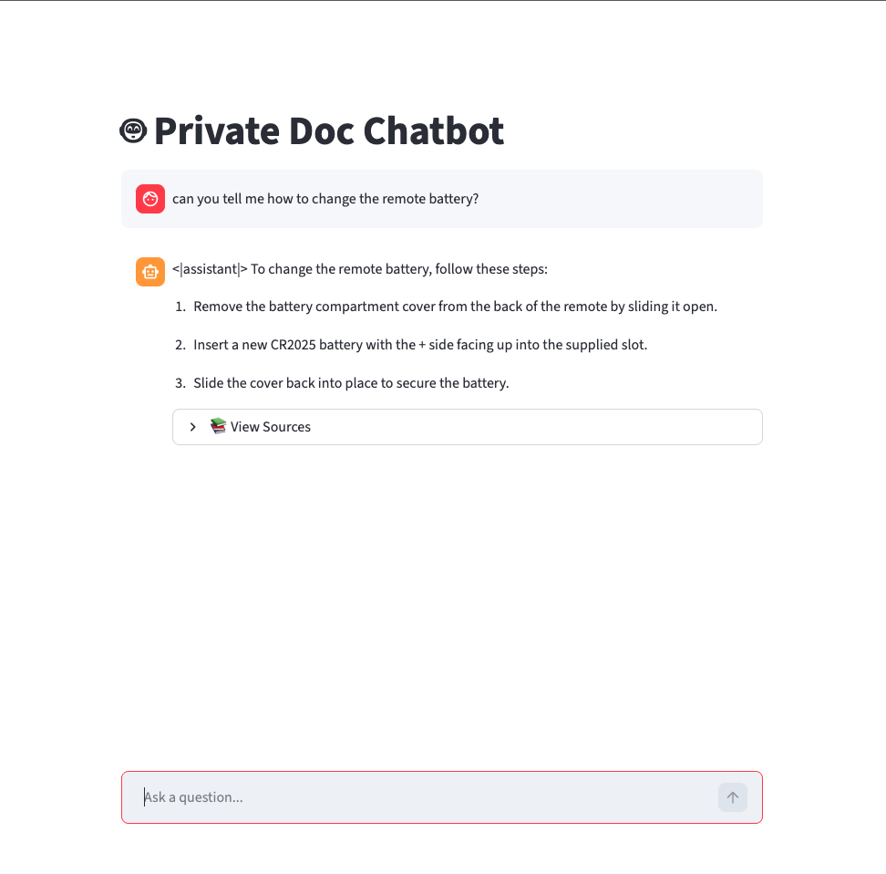

# Private RAG Chatbot (Local & Embedded)

A completely offline, privacy-first **Retrieval Augmented Generation (RAG)** chatbot designed to run on consumer hardware (specifically Apple Silicon Macs with 8GB+ RAM).

Unlike standard AI tools that send your data to the cloud (OpenAI/Anthropic), this project runs the entire "Brain" (LLM) and "Memory" (Vector Database) locally on your laptop. **Your documents never leave your machine.**
## Screenshots

## Screenshots



## 🚀 Key Features

* **🔒 100% Private:** No API keys required. No data transfer. Works without WiFi.
* **⚡ Embedded Architecture:** Uses a quantized **Phi-3 Mini** model (3.8B parameters) running efficiently on the CPU/GPU via `llama.cpp`.
* **📚 Verifiable Sources:** The bot cites exactly which document and page it used. Clicking the citation opens the PDF directly to that page.
* **🏎️ Apple Metal Optimization:** configured to offload model inference to the Mac GPU (M1/M2/M3) for fast responses.## ⚙️ Technical Specifications

### Hardware Requirements
* **OS:** macOS (Apple Silicon M1/M2/M3 recommended)
* **RAM:** Minimum 8GB (16GB recommended)
* **Disk Space:** ~4GB (Model is 2.3GB + Python environment)### Tech Stack
| Component | Technology | Role |
| :--- | :--- | :--- |
| **LLM Engine** | `llama-cpp-python` | Runs the AI model locally with hardware acceleration. |
| **Model** | `Microsoft Phi-3 Mini (4-bit)` | A highly efficient "Small Language Model" capable of reasoning. |
| **Vector DB** | `LanceDB` | Serverless vector storage to index your PDFs. |
| **Orchestration** | `LangChain` | Connects the database to the LLM. |
| **Frontend** | `Streamlit` | Provides the web chat interface. |

---
## 🛠️ Installation Guide

Follow these steps to set up the project from scratch.

### 1. Clone the Repository
```bash
git clone [https://github.com/yourusername/private-rag-chatbot.git](https://github.com/yourusername/private-rag-chatbot.git)

cd private-rag-chatbot
```

### 2. Create a virtual environment named 'env' using Python 3.11
```bash
python3.11 -m venv env
```

### 3. Activate the environment
```bash
source env/bin/activate
```

### 3. Install dependencies
```bash
pip install -r requirements.txt
```

### 4. Enable Apple Metal (GPU) Acceleration
```bash
CMAKE_ARGS="-DGGML_METAL=on" pip install llama-cpp-python --upgrade --force-reinstall --no-cache-dir
```

### 5. Download the LLM
```bash
python setup.py
```
## 📥 Data Ingestion Guide

This guide explains how to feed your own PDF documents into the "Brain" of the chatbot. The ingestion process reads your files, breaks them into small pieces (chunks), converts them into numbers (vectors), and saves them to the local database.

## 📂 The "Static" Folder

The system looks for documents in the **`static/`** directory. We use this specific folder name so that the web interface can also serve the files (allowing you to click "Open PDF" in the chat).

* **Location:** `./static`
* **Supported Format:** `.pdf` (text-based PDFs work best; scanned images may need OCR which is not currently enabled).

---

## 🏃‍♂️ How to Run Ingestion

### Step 1: Add Your Files
Simply drag and drop your PDF files into the `static/` folder in your project directory.

### Step 2: Run the Script
Open your terminal, ensure your virtual environment is active, and run the ingestion module:

```bash
# Make sure you are in the project root folder
python -m src.ingestion
```
## How to run

After completing the installation run:

```bash
streamlit run app.py
```
